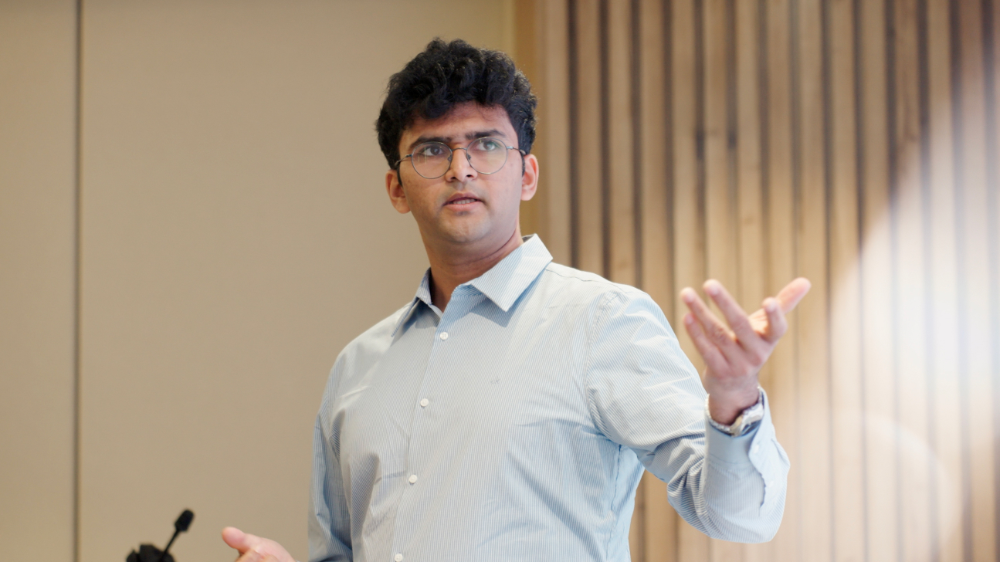

<!-- ## About Me -->

  

Hi, I'm Surya Narayanan Hari. I working to a PhD at Caltech. In my spare time, I enjoy peoplewatching and soccer. 

You may like this about me - my favorite books are The Prophet, Moby Dick and Shopgirl. My favorite movies are Tampopo and Children of Paradise. 

Reach out to me if you'd like to connect: allmynamestogether@gmail.com / firstinitiallastname@caltech.edu

<!-- Please fill out this form before we proceed: [https://forms.gle/SuPzCBeXCB26Zexa7](https://forms.gle/SuPzCBeXCB26Zexa7) -->

<!-- ## Typography

Something *italics* and something **bold**. -->

<!-- Here is a table

Year | Award | Category
-----|-------|--------
2014 | Emmy  | Won Outstanding Lead Actor in a miniseries or a movie
2015 | BAFTA | Nominated for Best Leading Actor for Sherlock
2014 | Satellite | Won Best Actor miniseries or television film

Here is a horizontal rule 
---
-->

<!-- ## To do
Add a [bibbase](https://bibbase.org/start) -->

## Random

> Higgins was so proficient in Carnatic music that he was called Higgins Bhagvathar. When he visited the Udupi Shri Krishna temple, he was denied entry because of his white skin by those who managed the temple. He stood at the gate and sang in chaste Kannada the Vyasatirtha composition, 'Krishna nee begane baro', an action that was similar to Kanaka Dasa's protest in 16th century. He was permitted entry immediately, possibly to avert an 'intervention from the deity', that Kanaka Dasa's legend spoke of.

 